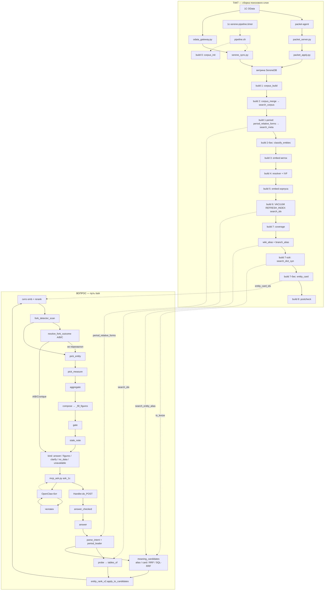

# Пайплайн: схема от кода

Источник — код HEAD: `ubuntu/serenedb/build.sh`, `ubuntu/serenedb/pipeline.sh`,
`ubuntu/serenedb/serene_ask.py`, `ubuntu/serenedb/entity_rank_v2.py`, мост
`ubuntu/openclaw/mcp_ask.py`. Исходы A/B/C — [`PLAN_ANSWER_CONTRACT.md`](PLAN_ANSWER_CONTRACT.md) §2.

Условные обозначения: сплошная стрелка — данные; пунктир — управление (таймер, HTTP).

**След в журнале:** при `ASK_TRACE=1` (умолчание) каждый шаг `answer()` пишет в stderr
`TRACE <rid> service <имя_шага> <мс> <статус>` (`_trace_write`). Параллельно накапливается
`diag.шаги` — тот же порядок, уходит клиенту в JSON ответа.

---

## Схема

---

## Флаги env (боевой okna `:8091`, август 2026)

Ритуал включения и снимки — [`F6_ROLLOUT_CHECKLIST.md`](F6_ROLLOUT_CHECKLIST.md).

| Флаг | Механизм | Дефолт | Бой okna |
|---|---|---|---|
| `ASK_SQL_RRF` | пятая ветвь ANN корпуса в `meaning_candidates` → `_fused_sql_rrf` | `0` | `1` |
| `ASK_HEALTH_NATIVE_FRESHNESS` | `/health`: `sdb_metrics` inverted (`index_buffered_docs`, `refresh_*`) | `0` | `1` |
| `ASK_HEALTH_SEARCH_IDX` | имя индекса для native freshness | `search_idx` | `search_idx` |
| `ASK_RESOLVER_IVF` | резолвер имён: IVF `<#>` при готовом индексе, иначе exact | `0` | `1` |
| `ASK_RESOLVER_IVF_IDX` | имя IVF резолвера | `resolver_ivf_idx` | `resolver_ivf_idx` |
| `ASK_SOLR_SYNONYMS` | `ts_lexize` по словарю синонимов в `same_concept_groups` и query-side | `0` | `1` |
| `ASK_SOLR_SYNONYMS_DICT` | имя словаря `ts_lexize` | `""` | `search_dict_syn` |
| `ASK_ATOM_TERMINAL` | исход `unique` с `proof_status=computed` → `kind=answer` без compose | `0` | `1` |
| `ASK_ENTITY_FORM` | форма F (`distinct_axis` / complement) до и после выбора сущности | `0` | `1` |
| `ASK_SALES_RANK_CANON` | канон ранга продаж + `period_form_from_question` / `prev_week` | `0` | `1` |
| `ASK_CALENDAR_AXIS` | ось календарь/рабочие дни (`calendar_axis_open`) | `0` | no-op (пустая `search_meta`) |
| `ASK_FORK_DETECT` | ранний `fork_detector_scan` по голове кандидатов | `1` | `1` |
| `ASK_FORK_OUTCOMES` | `resolve_fork_outcome` → A/B/C вместо только clarify-арбитра | `1` | `1` |
| `ASK_TRACE` | stderr `TRACE …` + `diag.шаги` | `1` | `1` |
| `ASK_ORDER_BY_MEANING` | сито по `emb <=>` карточки/метки перед реранкером | `1` | `1` |
| `ASK_RERANK_TOP` | бюджет названий в HTTP-реранкер | `60` | `60` |
| `ASK_STEM_DICT` | стемминг `ts_lexize` | `search_dict_stem` | `search_dict_stem` |
| `ASK_STALE_WARN_SEC` | порог приписки свежести в текст ответа | `3600` | `3600` |
| `ASK_JOURNAL` | запись в `ask_journal` из `answer_checked` | `1` | `1` |

Сопутствующие (не Ф6, но на пути): `ASK_EMBED_NATIVE`, `ASK_ALIAS_VETO`, `ASK_SKIP_SERVICE_RIVALS`,
`ASK_MEMORY_APPLY`, `DEEPSEEK_*`, `RERANK_*`, `EMBED_*` — см. шапку `serene_ask.py`.

---

## Путь `/ask` по шагам

Точка входа HTTP: `Handler.do_POST` → `answer_checked` → `answer` (внутри —
`_answer_checked_core` после билетов/памяти). Ниже — порядок в `answer()`; ранние
`return` (coverage, stock, `no_data`, clarify) обрезают хвост.

| № | Шаг | Что делает | Флаги / данные | TRACE (`service`) |
|---|---|---|---|---|
| 0 | HTTP + оболочка | auth, `decision_id`, `prior`, `seal_clarify`, журнал | `ASK_JOURNAL` | — |
| 1 | **Разбор** | `parse_intent` → kind/want/period/terms; YoY-guard | LLM | `разбор вопроса` |
| 1б | **Окна периода** | `apply_period_leader` + `period_readings`; фразы из `period_relative_forms` (`search_meta` или `period_relative_forms.json`) | `ASK_SALES_RANK_CANON`, `ASK_CALENDAR_AXIS` | (в `diag.period_leader`) |
| 2 | Ранние отказы | coverage, stock-named, `kind_unsupported`, assumed-period clarify | — | — |
| 3 | **Буквальный отбор** | `probe` → `match_expr` → `tables_of`; `partial_tables` в хвост | `search_idx`, `ASK_RESOLVER_IVF` в резолвере термов | `отбор: буквально` |
| 4 | **Смысл и синонимы** | `meaning_candidates`: `alias_hits` + kNN карточки/метки + SQL-RRF по корпусу | `ASK_SQL_RRF`, `ASK_SOLR_SYNONYMS`+`_DICT`, `ASK_STEM_DICT` | `отбор: смысл и синонимы` |
| 5 | Сборка `cands` | `by` + `extra`; `prefer_entity_for_rank/sales/catalog_count` | `ASK_SALES_RANK_CANON` | `кандидаты собраны` |
| 6 | **K6 v2** | `entity_rank_v2.apply_to_candidates`: expand holders, `features_table`, `q_meta_overlap`, `reorder_v2`; опционально dual-atom clarify | всегда при импорте модуля | `K6 v2` |
| 7 | Отсевы | `not_enough_for`; при `want=sum` — `with_value` / денежные | `search_entity_alias` | `отсев «не отвечает»` |
| 8 | **Порядок** | сито `emb <=>` (вопрос + kind) → `rerank` → parent-before-child | `ASK_ORDER_BY_MEANING`, `ASK_RERANK_TOP`; `meaning_down` → сбой эмбеддера | (в `diag.order_by`) |
| 9 | **Детектор развилки** | `fork_detector_scan` по голове пула; `diag.fork` | `ASK_FORK_DETECT` | `детектор развилки` |
| 10 | **Форма F (ранняя)** | `try_entity_form_answer(when=pre_entity)` | `ASK_ENTITY_FORM` | `форма сущности` |
| 11 | Канон продаж/прайса | `sales_canon_src`, `catalog_count_src` → lock пула | `ASK_SALES_RANK_CANON` | `канон продаж`, `канон прайса` |
| 12 | **Сущность** | `resolve_focus` / `pick_entity`; `align_picked_to_terms` | LLM в `pick_entity` | `сущность выбрана`, `круг арбитра`, `стоп2 соперники` |
| 13 | **Исходы A/B/C** | повторный scan по `arb_pool` → `resolve_fork_outcome` | `ASK_FORK_OUTCOMES`, `ASK_ATOM_TERMINAL` | `детектор исходов`, `исход A`, `исход B`, `исход C`, `исход unique→ответ` |
| 14 | Круг арбитра | под-вызовы `answer(focus=…)`; `answers_diverge` → clarify; иначе `arbitrate` (LLM) | `ASK_FORK_OUTCOMES=0` — старый путь | `круг арбитра` |
| 15 | **Форма F (поздняя)** | `try_entity_form_answer` после arb_pool | `ASK_ENTITY_FORM` | `форма сущности` |
| 16 | **Величина** | `pick_measure` / lock по билету | LLM | `величина выбрана` |
| 17 | **Счёт** | `aggregate` / `aggregate_groups` / rank-SQL | SQL в SereneDB | `посчитано базой`, `форма compare` |
| 18 | **Текст** | `compose` → `_fill_figures` → `build_answer_passport` | LLM в `compose` | — |
| 19 | **Гейт** | `gate` + одна retry-compose; иначе `kind=figures` или `period_empty` | — | `гейт исходящего` |
| 20 | **Свежесть** | `search_quality.build_ts` → `diag.data_age_sec`; `stale_note` в текст | `ASK_STALE_WARN_SEC`, `ASK_STALE_TEXT` | — |

`/health` (GET): полнота корпуса, `period_relative_forms`, при `ASK_HEALTH_NATIVE_FRESHNESS` —
блок `freshness` с native-метриками индекса; лаг витрины → `coverage_gap.kind=freshness_lag`.

---

## Исходы ответа

### `kind` HTTP-ответа

| `kind` | Когда | Код |
|---|---|---|
| `answer` | гейт ok; текст + `figures`/`atom` | `compose` → `gate` |
| `figures` | гейт отверг прозу, числа из базы верны | после `gate` |
| `clarify` | неоднозначность сущность/мера/ось/fork; enough; билет | `seal_clarify`, `fork_outcome_c`, арбитр |
| `no_data` | нет кандидатов / термы не найдены / gate empty | ранние ветки, `gate` |
| `unavailable` | сбой контура, исключение handler | `do_POST` except |

Мост `mcp_ask`: `pending.refuse` / `short_circuit` до POST; текстовый выбор clarify →
`decision_id` (`mcp_ask_pending.py`).

### Модель A/B/C ([`PLAN_ANSWER_CONTRACT.md`](PLAN_ANSWER_CONTRACT.md) §2)

Детектор: `fork_detector_scan` + `fork_classes` по полному `AnswerAtom`. Рендер:
`fork_outcome_a` / `fork_outcome_b` / `fork_outcome_c` / `fork_outcome_unique`.

| Исход | Условие в коде | Человеку |
|---|---|---|
| **единственность** | `resolve_fork_outcome` → `unique`; один класс, один атом | `kind=answer`, паспорт набора |
| **A** | `_outc == "A"` | ответ источник-нейтрально (`fork_outcome_a`) |
| **B** | `_outc == "B"`; все ветки с подписью (`search_fork_label`) | лидер `picked[0]` + `options` остальных (`fork_outcome_b`); при rank — `rank_defer_fork_outcome_b` |
| **C** | `_outc == "C"`; непосчитанная / неподписанная ветка | clarify или «есть другое прочтение» + число лидера (`fork_outcome_c`) |
| **no_data** | пустое пространство | `NO_DATA_TEXT` |
| **unavailable** | `fork` scan error / сбой сервиса | явное сообщение, `retry` |

`ASK_ATOM_TERMINAL=1`: при `unique` и `proof_status=computed` — терминальный ответ без
повторного compose (`try_atom_terminal_answer` / `fork_outcome_unique`).

Канон продаж ([`PLAN_ANSWER_CONTRACT.md`](PLAN_ANSWER_CONTRACT.md) §6bis): регистр
`written_by`, не документ; `sales_canon_force_pool` схлопывает `arb_pool` после lock.

---

## K6 v2 (`entity_rank_v2.py`)

Вызывается из `answer()` сразу после `prefer_entity_*`, до реранкера.

1. Восстановление `kind` из пересечения алиасов (`kind_from_alias_overlap`).
2. `infer_rank_form` → sum / distinct / complement / count.
3. `expand_holders` + `expand_stem_and_live` — пул регистров и каталогов.
4. `features_table` — `axis_fit`, `n_dated`, `n_cards`, **`q_meta_overlap`** (stem вопроса ↔
   label/aliases), `q_row_ratio`.
5. `reorder_v2` / `rank_key_v2` — лексикографический ключ без порогов.
6. `dual_atom_pair` → опциональный clarify двух атомов (не при `rank_intent`).

Диагностика: `diag.answer_fit_v2` (топ-12 src с признаками). Сбой SQL → `answer_fit_v2_down`,
порядок без K6.

---

## Отбор: три поверхности + RRF

После `parse_intent` поверхности **складываются** (комментарий «ТРИ ПОВЕРХНОСТИ» в `answer`):

1. **Буквально** — `probe` → `tables_of` по `search_idx` (`@@`, scorer `ASK_SCORER`).
2. **Синонимы сущности** — `alias_hits` по `alias_idx`; при `ASK_SOLR_SYNONYMS` стемм +
   `ts_lexize(ASK_SOLR_SYNONYMS_DICT, …)` в `same_concept_groups`.
3. **Смысл названия** — kNN по `search_entity_card` (или `search_tables`) + SQL-RRF
   (`ASK_SQL_RRF` + готовый `corpus_ivf_idx`).

Частичные совпадения — хвост `partial_tables`, не шлюз. Резолвер значений термов: exact или
IVF (`ASK_RESOLVER_IVF`).

---

## Такт сборки (кратко)

| Шаг | Скрипт | Продукт |
|---|---|---|
| sync | `pipeline.sh` → `serene_sync.py` / packet | витрина EntitySet |
| 0 | `corpus_init.sql` | объекты поиска, словари |
| 1 | `corpus_build.sql` | черновой корпус |
| 2 | `corpus_merge.sql` | `search_corpus`, `search_idx` |
| 1-period | `period_relative_forms_load.sql` | `search_meta.period_relative_forms` |
| 2-бис | `classify_entities.py` | `search_entity_class` |
| 3–5 | `embed_missing.sh` | векторы меток, резолвер, корпус |
| 6 | `VACUUM (REFRESH_INDEX)` | обновление `search_idx` |
| 7 | `coverage_build.sql` | `search_coverage` |
| 7 | `wiki_alias.sh`, `branch_alias.sh` | `search_entity_alias`, `search_fork_label` |
| 7-solr | `solr_synonyms_build.py` | `search_dict_syn` |
| 7-бис | `entity_card_build.sql` | `search_entity_card` |
| 8 | `corpus_postcheck.sql` | сверка отпечатка |

Ветка витрины: каталог `ETL_ODATA_BASE` → packet + `KEEP_MARKS`; URL → HTTP через
`odata_gateway.py` (`pipeline.sh`).

---

## Где зовётся языковая модель (п. 19)

Chat **не считает и не ищет** — только разбор/выбор метки/проза:

| Шаг | Функция |
|---|---|
| разбор вопроса | `parse_intent` / `_one_intent` |
| выбор сущности | `pick_entity` |
| проза / уточнение | `compose`, `clarify_text`, `refuse_text` |
| арбитр текстов (хвост) | `arbitrate` — только если числа сошлись, а тексты разошлись |
| разметка такта | `classify_entities.py` |
| словарь алиасов | `wiki_alias.sh` → OpenClaw infer |
| достаточность фразы | `serene_enough.py` → `need_say` |

Не chat: `embed_one` / `ai_embed`, HTTP-реранкер, `fork_detector_scan`, `aggregate*`,
`entity_rank_v2`, `gate`.

---

## Чего на схеме нет

Процессы vLLM (эмбеддер, chat 27B, реранкер): вызовы по URL из env, узлов «модель» в
коде нет. OpenClaw (тон, Telegram, перефраз до `ask_1c`) — вне `mcp_ask`/`serene_ask`.
OData на пути вопроса не участвует: `/ask` читает собранный корпус и индекс.

Формат ссылок `путь · якорь (~N)` — якорь для навигации в исходнике. Оффлайн-замок
черновика: `ubuntu/serenedb/test_pipeline_doc.py` (если есть в дереве).
