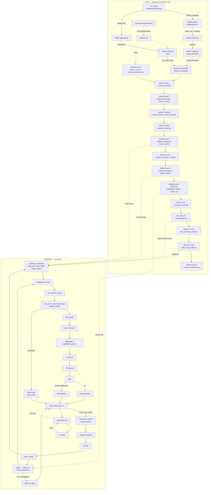

# Пайплайн: схема от кода (Ш0)

Источник — код, не память: `ubuntu/serenedb/build.sh`, `ubuntu/serenedb/pipeline.sh`,
`ubuntu/serenedb/serene_ask.py` (след `шаг("…")` в `answer`), packet/gateway/мост.
Ожидание плана: [`PLAN_TO_TARGET.md`](PLAN_TO_TARGET.md) § Этап 0.

Условные обозначения: сплошная стрелка — данные; пунктир — управление (таймер, HTTP-вызов).

---

## Схема

---

## Таблица узлов

| Имя | Скрипт / функция | Что делает | Если узел молчит |
|---|---|---|---|
| 1С OData | `windows/odata-setup/src/Program.cs` · якорь `static int Main` (~52) | Отдаёт EntitySet / `$metadata` на чтение | Нет сырья → витрина и корпус пустеют |
| packet-agent | `windows/packet-agent/src/PacketAgent.cs` · якорь `while (true)` (~1131) | Такт: дельта → чанки → HTTPS | Ветка A: витрина не обновляется |
| packet_server | `ubuntu/packet/packet_server.py` · якорь `PACKET_LISTEN` (~20) | Приём, verify age+sha256 | Пакеты не доходят до apply |
| packet_apply | `ubuntu/packet/packet_apply.py` · якорь `def apply_package` (~783) | `verified→applied`, merge в витрину | Свежие строки 1С не в поиске |
| odata_gateway | `ubuntu/1c-gateway/odata_gateway.py` · якорь `LISTEN_HOST` (~46); · якорь `def main()` (~139) | Шлюз только GET → 1С | Ветка B: синк не читает OData |
| serene_sync | `ubuntu/serenedb/serene_sync.py` · якорь `def main():` (~253); зов: `ubuntu/serenedb/pipeline.sh` · якорь `python serene_sync.py` (~49) | Дельта витрины (`poc_load_entity`); на packet — KEEP_MARKS | Витрина устаревает; корпус копирует старое |
| pipeline.timer / pipeline.sh | `ubuntu/systemd/1c-serene-pipeline.timer`; `ubuntu/serenedb/pipeline.sh` · якорь `синк витрины` (~33); · якорь `exec ./build.sh` (~57) | Один такт: sync → build | Поисковый слой не пересобирается |
| build шаг 0 | `ubuntu/serenedb/build.sh` · якорь `== 0. объекты поиска` (~146) → `corpus_init.sql`, `corpus_precheck.sql` | Объекты поиска, отпечаток, секреты, живость эмбеддера | Такт падает fail-closed до сборки |
| corpus_build | `ubuntu/serenedb/build.sh` · якорь `== 1. корпус` (~255) → `corpus_build.sql` | Текст `doc`, maps, nums из витрины + `$metadata` | Нет нового корпуса |
| corpus_merge | `ubuntu/serenedb/build.sh` · якорь `corpus_merge.sql` (~279) | Слияние в `search_corpus` + первая публикация индекса | Боевой корпус/индекс не обновлены |
| 1-period | `ubuntu/serenedb/build.sh` · якорь `== 1-period` (~292) → `period_relative_forms_load.sql` | Относительные окна → `search_meta` | «прошлая неделя» домысливается неверно |
| classify | `ubuntu/serenedb/build.sh` · якорь `python3 classify_entities.py` (~313) | business/service → `search_entity_class` | GPU считает служебное; такт стоп при недоступной модели |
| embed меток | `ubuntu/serenedb/build.sh` · якорь `== 3. векторы меток` (~352) → `embed_missing.sh` | `search_tables.label` → `emb` | Смысловой выбор сущности без kNN по меткам |
| resolver | `ubuntu/serenedb/build.sh` · якорь `== 4. резолвер` (~358) → `resolver_build.sql` | Значения измерений + их векторы | Имена («Питер») не резолвятся в ключи |
| embed корпуса | `ubuntu/serenedb/build.sh` · якорь `== 5. векторы` (~393) → `embed_missing.sh` | `search_corpus.doc` → `emb` (не-service) | Смысловой отбор по строкам корпуса слепой |
| search_idx | `ubuntu/serenedb/build.sh` · якорь `VACUUM (REFRESH_INDEX) search_idx` (~420) | Инвертированный индекс BM25 | Буквальный `probe` / BM25 пустой или устаревший |
| coverage | `ubuntu/serenedb/build.sh` · якорь `coverage_build.sql` (~428) | Перепись полноты 1С→поиск | Вопросы `about=coverage` без цифр; п.13 слепой |
| wiki_alias | `ubuntu/serenedb/build.sh` · якорь `./wiki_alias.sh` (~437) | Обиходные слова → `search_entity_alias` | `alias_hits` не находит «продажу»=реализация |
| solr_synonyms | `ubuntu/serenedb/build.sh` · якорь `== 7-solr` (~445) → `solr_synonyms_build.py` | Словарь `ts_lexize` из alias | Синонимы на вопросе не раскрываются |
| entity_card | `ubuntu/serenedb/build.sh` · якорь `entity_card_build.sql` (~461) | Карточка + emb для отбора | Откат на метку (`near_tables` / `emb_ready`) |
| postcheck | `ubuntu/serenedb/build.sh` · якорь `corpus_postcheck.sql` (~468) | Сверка с отпечатком | Тихая потеря данных не ловится кодом такта |
| mcp ask_1c | `ubuntu/openclaw/mcp_ask.py` · якорь `def ask_1c` (~485); · якорь `ASK_URL + "/ask"` (~113); · якорь `ASK_URL` (~46) → default `:8099` | Мост бот → POST `/ask` | Бот без фактов из базы |
| Handler | `ubuntu/serenedb/serene_ask.py` · якорь `class Handler` (~15724); · якорь `ASK_LISTEN_PORT` (~73) → default `:8091` | HTTP `POST /ask` | Сервис не принимает вопросы |
| answer_checked | `ubuntu/serenedb/serene_ask.py` · якорь `def answer_checked` (~15558) | Вход ответа + enough до/после | Нет оркестрации ответа |
| answer | `ubuntu/serenedb/serene_ask.py` · якорь `def answer(` (~11956) | Разбор→отбор→счёт→гейт; след `шаг("…")` | Нет пути вопроса |
| parse_intent | `ubuntu/serenedb/serene_ask.py` · якорь `def parse_intent` (~1289) | Вопрос → JSON intent (LLM) | Нет периода/термов/меры |
| probe / tables_of | `ubuntu/serenedb/serene_ask.py` · якорь `def probe` (~2640); · якорь `def tables_of` (~2935) | Буквальный отбор по `search_idx` | Нет кандидатов по словам строки |
| meaning_candidates | `ubuntu/serenedb/serene_ask.py` · якорь `def meaning_candidates` (~3087); · якорь `def alias_hits` (~2991); · якорь `def near_tables` (~3294) | Синонимы + kNN + RRF | «продажа» не находит реализацию |
| embed_one | `ubuntu/serenedb/serene_ask.py` · якорь `def embed_one` (~744) | Вектор вопроса (HTTP или `ai_embed`) | Смысловой путь без вектора вопроса |
| fork_detector | `ubuntu/serenedb/serene_ask.py` · якорь `def fork_detector_scan` (~4255) | Классы развилок окон/источников | Пропуск неоднозначности → неверный ответ |
| арбитр семей | `ubuntu/serenedb/serene_ask.py` · якорь `def answers_diverge` (~6921); · якорь `круг арбитра` (~13404) | Счёт соперников, сравнение чисел | Выбор сущности без сверки альтернатив |
| pick_entity | `ubuntu/serenedb/serene_ask.py` · якорь `def pick_entity` (~8261) | Модель выбирает метку сущности | Неверный / случайный источник |
| pick_measure | `ubuntu/serenedb/serene_ask.py` · якорь `def pick_measure` (~8213) | Величина по слову вопроса | Считается не та колонка |
| aggregate | `ubuntu/serenedb/serene_ask.py` · якорь `def aggregate(` (~8465) | Итог SQL в базе | Нет числа для ответа |
| compose / fill | `ubuntu/serenedb/serene_ask.py` · якорь `def compose` (~9583); · якорь `def _fill_figures` (~9100) | Проза со слотами → подстановка чисел | Пустой или рукописный текст |
| gate | `ubuntu/serenedb/serene_ask.py` · якорь `def gate(` (~10284) | Числа в тексте = из базы | Выдуманные цифры уходят человеку |
| seal_clarify | `ubuntu/serenedb/serene_ask.py` · якорь `def seal_clarify` (~7133) | `decision_id` на options | Уточнение без билета, цикл ломается |

Взаимоисключение витрины A/B: `ETL_ODATA_BASE` как каталог → packet + KEEP_MARKS;
как URL → HTTP через шлюз. Детект: `ubuntu/serenedb/pipeline.sh` · якорь `if [ -d "${ETL_ODATA_BASE:-}" ]` (~43).

---

## Развилки

### Исход ответа: clarify / figures / answer / no_data

| Исход `kind` | Когда | Код |
|---|---|---|
| `clarify` | сомнение сущность/мера/ось/fork; enough до поиска; bridge остатков | `ubuntu/serenedb/serene_ask.py` · якорь `def seal_clarify` (~7133); · якорь `def clarify_text` (~3448) |
| `figures` | `gate` отверг прозу, числа из базы верны | `ubuntu/serenedb/serene_ask.py` · якорь `def gate(` (~10284); исход после fill |
| `answer` | gate ok, текст + подставленные числа | `compose` → `_fill_figures` → `gate` |
| `no_data` | нет совпадений термов; именованный остаток без источника | `ubuntu/serenedb/serene_ask.py` · якорь `значения из вопроса не найдены` (~12118); · якорь `stock_balance_named_no_data` (~12071) |

Мост `mcp_ask` дополнительно: `pending.refuse` / `short_circuit` до POST
(`ubuntu/openclaw/mcp_ask.py` · якорь `apply_pending_before_ask` (~519)).

### Вектор vs буквальный отбор

В `answer` после `parse_intent` обе поверхности **складываются**, не заменяют друг друга
(комментарий «ТРИ ПОВЕРХНОСТИ», ~12139):

1. **Буквально** — `probe` → `tables_of` по `search_idx` (след `шаг("отбор: буквально")`).
2. **Смысл и синонимы** — `meaning_candidates` = `alias_hits` + `near_tables` (+ RRF);
   след `шаг("отбор: смысл и синонимы")`.
3. Частичные совпадения — хвост кандидатов (`partial_tables`), не шлюз.

Буквальный мусор больше не закрывает смысловой путь.

### Арбитр семей

При нескольких кандидатах разных семей (`_family` в `answer`): пул `arb_pool`,
повторный счёт с `no_arbiter=True`, сравнение `answers_diverge` / `arbiter_figures`.
Совпали числа — один ответ; разошлись — `clarify` с options; fork-исходы A/B/C —
`resolve_fork_outcome` (~6391), `fork_detector_scan` (~4255).

---

## Где зовётся языковая модель (п. 19)

Chat **не считает и не ищет** — только разбор/выбор метки/проза:

| Шаг | Функция |
|---|---|
| разбор вопроса | `parse_intent` / `_one_intent` |
| выбор сущности | `pick_entity` |
| проза / уточнение | `compose`, `clarify_text`, `refuse_text` |
| арбитр текстов | `arbitrate` |
| разметка такта | `classify_entities.py` |
| словарь алиасов | `wiki_alias.sh` → OpenClaw infer |

Не chat: `embed_one` / `ai_embed`, HTTP-реранкер, все `aggregate*`.

---

## Чего на схеме нет, но влияет

На схеме нет процессов vLLM (эмбеддер Qwen3-Embedding, chat 27B / DeepSeek для
ответов, реранкер Qwen3-Reranker): ask и такт ходят к ним по URL из `/etc/1c-embed.env`
и env сервиса, но узлов «модель» в коде пайплайна нет — есть только вызовы
(`embed_one`, `ds_chat`, `classify_entities`, `wiki_alias`). Нет и живого шлюза 1С
как отдельного шага вопроса: OData нужен такту (sync/apply/`$metadata`), а `/ask`
читает уже собранный корпус и индекс в SereneDB. Конфиг OpenClaw (тон бота, Telegram,
перефраз до `ask_1c`) лежит вне `mcp_ask`/`serene_ask` и на схему пути фактов не
рисуется.

---

Формат ссылок `путь · якорь (~N)` — якорь обязан быть в файле; `~N` справочный.
Оффлайн-замок черновика: `ubuntu/serenedb/test_pipeline_doc.py` (если лежит рядом).
